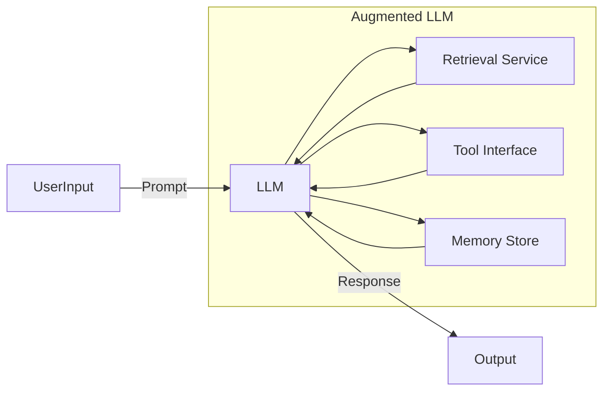
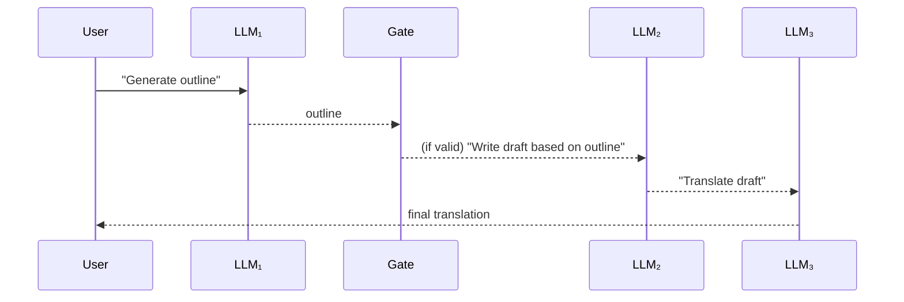
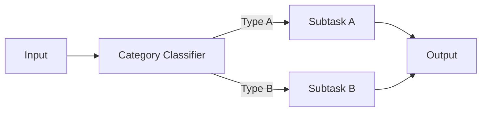
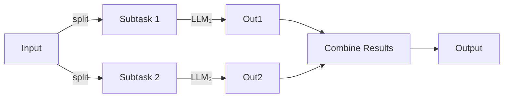
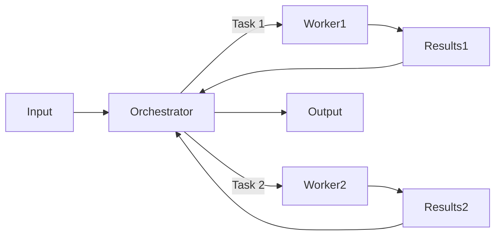
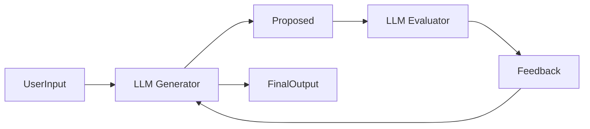
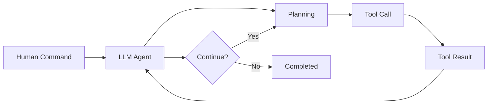

## Pattern: Augmented LLM

### Summary  
An **Augmented LLM** is a large-language model enhanced with plugins for retrieval, tool invocation and memory. It generates its own search queries, selects and invokes tools as needed, and persists relevant information for future steps.

### Details  
- **Retrieval**: On-demand access to up-to-date knowledge bases or document stores.  
- **Tool Interface**: Unified plumbing for invoking external APIs, running code or querying databases.  
- **Memory Store**: A mechanism for retaining and recalling key facts or conversation context across turns.  

### Mermaid Diagram  

### Use Cases  
- **Interactive assistants** that need up-to-minute data (e.g. weather, stock quotes).  
- **Multi-stage tasks** where each result influences the next (e.g. research and synthesis).

### When to Use / Avoid  
- **Use** when you require external knowledge, actions or a stateful dialogue.  
- **Avoid** for simple single-turn queries that do not need tool calls or memory.

### Example  
A customer-support bot that looks up orders, issues refunds via an API, and recalls past interactions to personalise follow-up.

---

## Pattern: Prompt Chaining

### Summary  
**Prompt Chaining** divides a complex job into sequential steps. Each LLM call consumes the previous output, and optional programmatic “gates” validate intermediate results.

### Details  
1. **Task Decomposition**: Define clear subtasks (e.g. outline → review → full draft).  
2. **Sequential Chaining**: Pass the output of step _n_ as input to step _n+1_.  
3. **Gates**: Insert code checks or classifiers to ensure each step yields valid intermediate data.

### Mermaid Diagram  

### Use Cases  
- **Content creation**: Draft an outline, validate, then generate full copy.  
- **Pipeline tasks**: Translate text, then summarise, then format for publication.

### When to Use / Avoid  
- **Use** when subtasks are well-defined and independent.  
- **Avoid** if the steps are highly interdependent or non-linear.

### Example  
Generate marketing copy, check tone against brand guidelines, then translate into French.

---

## Pattern: Routing

### Summary  
**Routing** classifies each input and directs it to one of several specialised sub-flows, ensuring each category is handled by the optimal prompt or model.

### Details  
- **Classifier**: An LLM or ML model assigns an input type.  
- **Branches**: Each type triggers a distinct prompt sequence or tool set.  
- **Aggregation**: Consolidate or directly return the branch output.

### Mermaid Diagram  

### Use Cases  
- **Customer support**: Route billing queries separately from technical issues.  
- **Cost optimisation**: Send simple questions to lightweight models, complex ones to more powerful models.

### When to Use / Avoid  
- **Use** for heterogeneous inputs with clear categories.  
- **Avoid** if misclassification carries high cost or categories overlap substantially.

### Example  
A chatbot that routes refund requests to a finance API and technical issues to a knowledge-base lookup.

---

## Pattern: Parallelization

### Summary  
**Parallelization** executes multiple LLM calls concurrently, either by **sectioning** a task into independent parts or by **voting** across repeated runs.

### Details  
- **Sectioning**: Split a task into distinct subtasks (e.g. draft, review, fact-check) and run each in parallel.  
- **Voting**: Run the same prompt multiple times to acquire diverse outputs, then aggregate by majority or scoring.

### Mermaid Diagram  

### Use Cases  
- **Speed-sensitive** tasks: Section reports or analyses for faster turnaround.  
- **Confidence building**: Voting on code vulnerabilities or content moderation decisions.

### When to Use / Avoid  
- **Use** when subtasks are independent or multiple perspectives enhance reliability.  
- **Avoid** for strictly sequential processes where later steps depend on earlier results.

### Example  
Run three headline generators in parallel and select the most common wording.

---

## Pattern: Orchestrator-Workers

### Summary  
An **Orchestrator** LLM dynamically decomposes a task into subtasks, delegates them to **Worker** LLMs, and synthesises their outputs into a final result.

### Details  
1. **Orchestration**: Parse the user’s goal and plan subtasks.  
2. **Delegation**: Send each subtask to a dedicated worker model or prompt.  
3. **Synthesis**: Collect worker outputs and integrate them coherently.

### Mermaid Diagram  

### Use Cases  
- **Code refactoring**: Inspect and update multiple files based on a single instruction.  
- **Complex aggregation**: Gather and combine data from varied sources.

### When to Use / Avoid  
- **Use** when subtasks cannot be predetermined and require dynamic discovery.  
- **Avoid** if subtask boundaries are fixed—prefer simple parallelisation or chaining.

### Example  
An agent that scans a repository, identifies affected modules, applies fixes, then merges the changes.

---

## Pattern: Evaluator-Optimizer

### Summary  
The **Evaluator-Optimizer** pattern iterates between a **Generator** LLM producing a draft and an **Evaluator** LLM providing critiques, refining output until quality criteria are met.

### Details  
1. **Generation**: Produce an initial response.  
2. **Evaluation**: Critique against defined standards.  
3. **Optimization**: Revise the draft based on feedback.  
4. **Loop**: Repeat until the output satisfies quality thresholds.

### Mermaid Diagram  

### Use Cases  
- **Literary translation**: Ensure nuance and tone are preserved.  
- **Iterative analysis**: Generate a report, evaluate coverage, then expand or refine.

### When to Use / Avoid  
- **Use** when evaluation criteria are clear and iterative refinement yields measurable gains.  
- **Avoid** if evaluation is too subjective or cannot be automated.

### Example  
Translate a technical document, have the evaluator check for accuracy and clarity, then update the translation accordingly.

---

## Pattern: Autonomous Agent

### Summary  
A fully **Autonomous Agent** sets its own plan from a human-provided goal, executes actions via tools, perceives results as ground truth, and iterates until success or a stopping condition.

### Details  
1. **Goal Definition**: Receive a command or engage interactively.  
2. **Planning**: Devise a multi-step course of action.  
3. **Execution Loop**:  
   - **Action**: Call tools or APIs.  
   - **Perception**: Observe and record results.  
   - **Decision**: Replan or continue.  
4. **Termination**: Conclude on success criteria or max iterations.

### Mermaid Diagram  

### Use Cases  
- **Autonomous code repair**: Iterate through tests, logs and patches until all tests pass.  
- **“Computer use” agents**: Control GUI applications or remote systems to fulfil complex tasks.

### When to Use / Avoid  
- **Use** for open-ended tasks where the number of steps cannot be predetermined.  
- **Avoid** for linear, well-defined workflows—employ simpler patterns to save on cost and latency.

### Example  
An agent that diagnoses server issues by running diagnostics, analysing logs, applying fixes and verifying resolution in a closed loop.